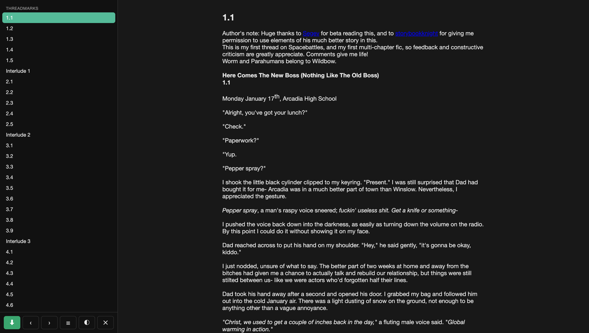
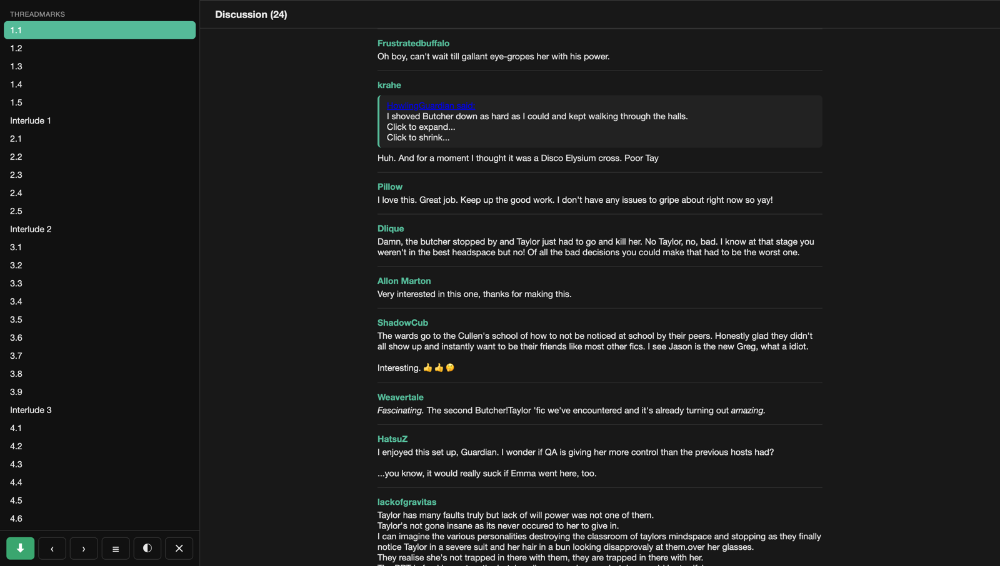
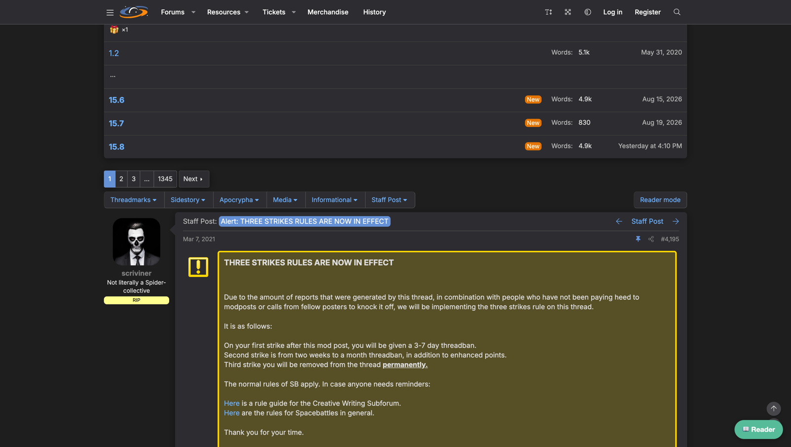
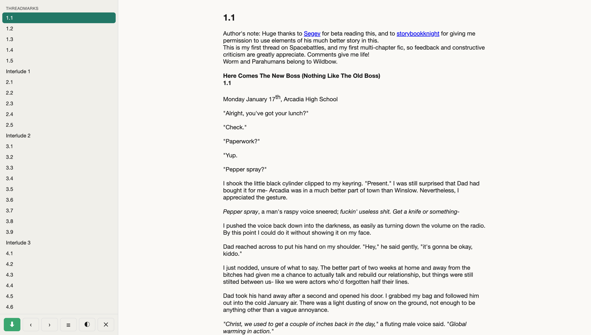

# XenForo Story Reader

[](https://raw.githubusercontent.com/elfensky/xenforo-story-reader/main/xenforo-story-reader.user.js)

A Tampermonkey userscript that turns a threadmarked XenForo story thread into an
AO3/FFN-style reader: chapter table of contents, the chapter body as the focus, and the
forum discussion between chapters shown inline as comments under each chapter.

Works on Questionable Questing, SpaceBattles, and Sufficient Velocity (any XenForo forum
with threadmarks — all selectors live in one Adapter).

## What it looks like

The reader, opened on a SpaceBattles story — chapter TOC on the left, chapter as the focus:



The forum posts between two chapters, collected as comments under the chapter, behind a
sticky section bar:



| Without the reader | Light theme |
|---|---|
|  |  |

## Install

1. Install [Tampermonkey](https://www.tampermonkey.net/) (or Violentmonkey/Greasemonkey).
2. Click the **Install** button above — the extension opens its install screen.
3. Open a threadmarked story thread; a floating **Reader** button appears bottom-right.

Updates ship through the script's `@updateURL`, so installs stay current automatically.

## Features

- **Instant open** — chapter index cached in IndexedDB, 0ms rebuild after first load.
- **Two reading orders** — story-first (grouped by threadmark category) or fully chronological (omake/extras interleaved).
- **Inline discussion** — the forum posts between two chapters shown as comments under each chapter, with a sticky section bar.
- **EPUB export** — whole story to a valid EPUB2, built in the browser (hand-rolled ZIP, sanitized XHTML).
- **Polite fetching** — capped concurrency, request gap, retry with backoff on 429/503.
- **Read-only** — fetch, parse, render, export. Never posts, likes, or touches the account.

## Roadmap

1. In-chapter scroll progress + read/unread state.
2. Keyboard nav (J/K, arrows, Esc).
3. TOC search/filter; typography controls (font size / width / line-height).

## Development

Single file, no build step. Architecture and selector notes: [CONTEXT.md](CONTEXT.md).

Tests (vitest + happy-dom; the script exposes its internals via a test hook that is inert
in the browser):

```sh
npm install
npm test        # unit (adapter parsing, EPUB pipeline) + smoke (metadata block)
npm run e2e     # injects into a real thread via a local chrome-devtools daemon
```

Unit and smoke run in CI on every push; e2e is machine-local (it needs a logged-in
Chrome with CDP — see the header of [e2e/run.sh](e2e/run.sh)).

## License

MIT
